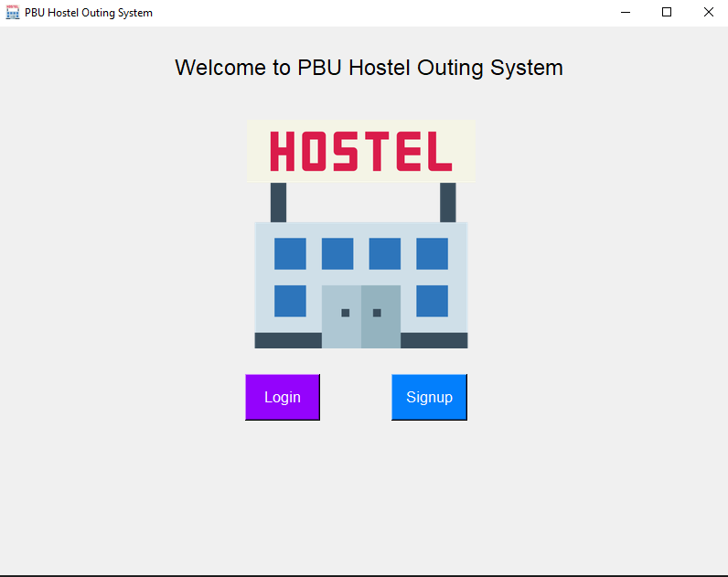
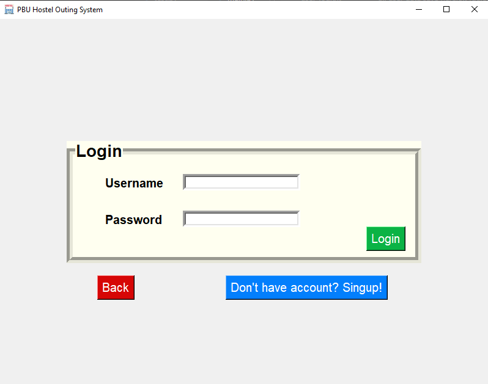
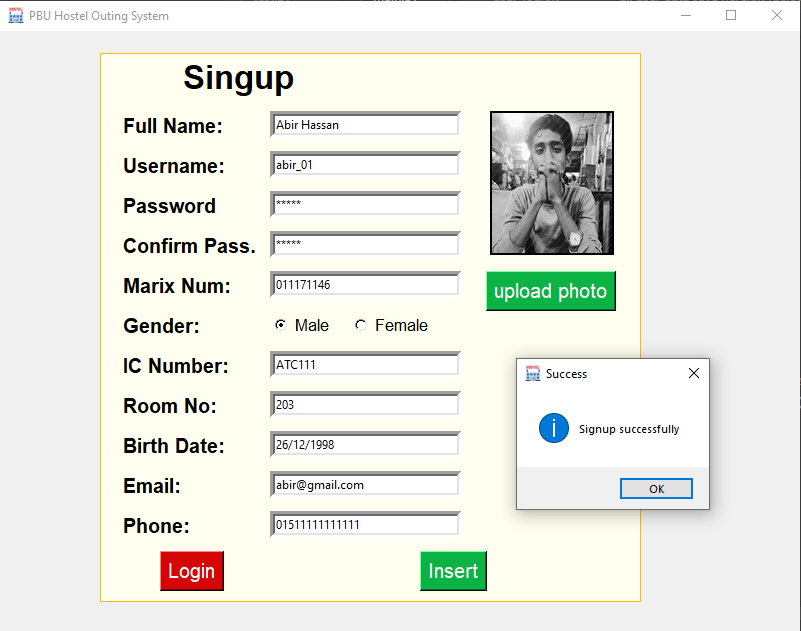
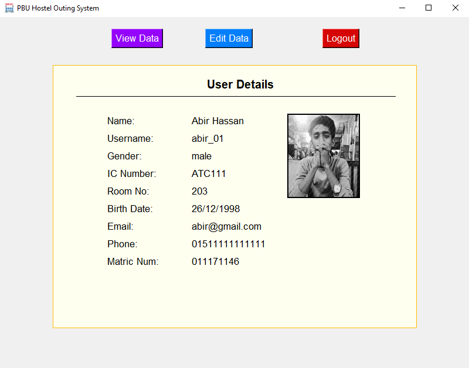
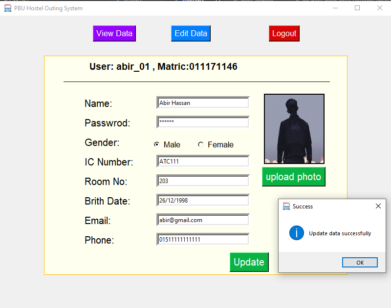
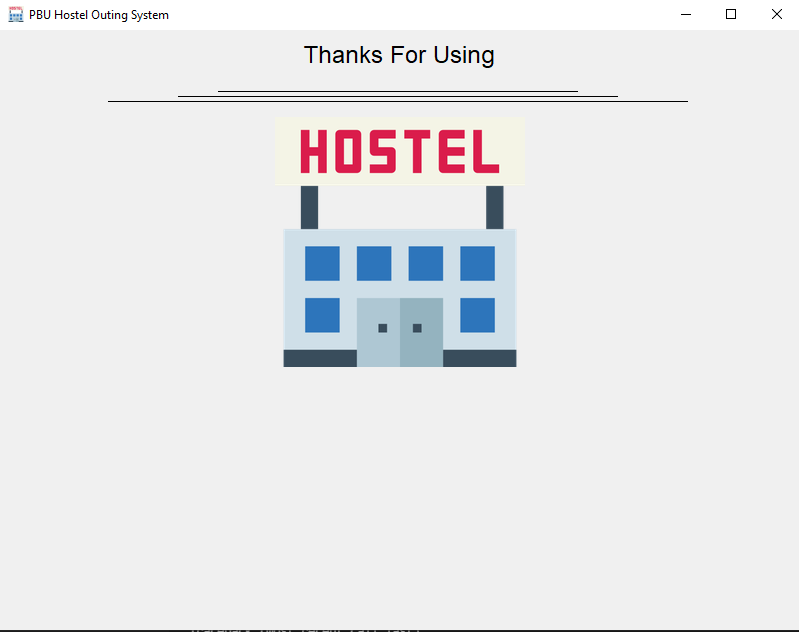

# hotel_outgoing
A simple outgoing system using python tkinter.(2020)

This project was developed in 2020. This is a simple hostel outgoing system. My first use of python tkinter (GUI). This also has a mysql database connection to save user data.

## Project description
Name: Hotel Outgoing  
Programming Language: Python  
GUI: Tkinter  
Project No: 17  
Year: 2020

## Demo Video

## Screen shot

### Home

### Login

### Signup

### View Data

### Edit

### Logout

## Authors

* **AbirHasan**

Check out my other works [@XAbirHasan](https://github.com/XAbirHasan)
